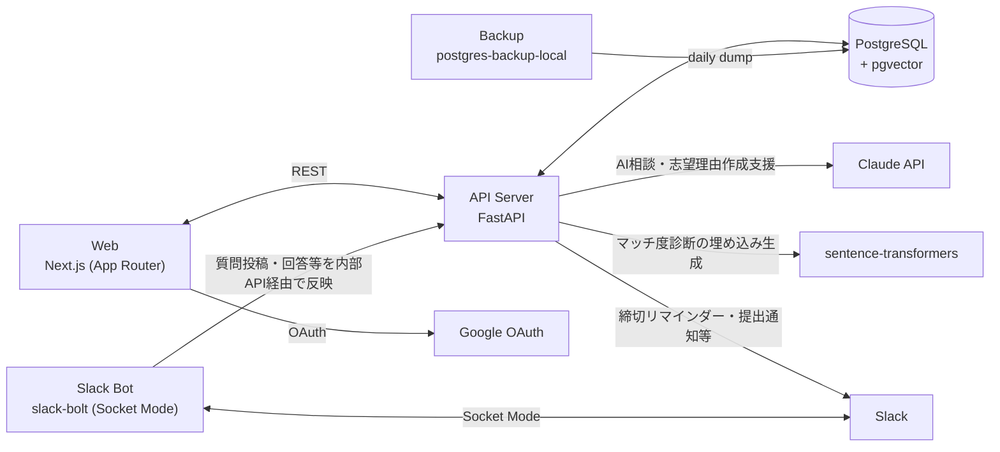

# ゼミ選択・配属支援プラットフォーム

学生が研究内容や将来の興味に合ったゼミを見つけられるよう支援し、教員側の応募管理・選考業務も効率化するWebシステム。武蔵野大学データサイエンス学科での長期運用を想定している。

詳細な要件・DB設計・画面設計は [docs/requirements.md](docs/requirements.md) を参照。

## Architecture



> Slack Botは`slack-bolt`のSocket Modeで動くため、外部から到達可能な公開URL・ポート公開は不要（アウトバウンド接続のみ）。学生からの質問投稿・教員への回答依頼などインタラクティブな操作（モーダル・ボタン）を扱い、内部API（`INTERNAL_API_SECRET`）経由でAPI Serverとやり取りする。
>
> 締切リマインダー・志望提出確認・回答通知などAPI起点のSlack通知は、API Serverが`slack-bolt`を介さず直接Slack Web APIを呼び出して送信する（`apps/api/src/api/slack_client.py`）。
>
> マッチ度診断（学生の興味・研究テーマとゼミの類似度）はsentence-transformersでベクトル化しpgvectorで類似検索する。AI相談アシスタント・志望理由の壁打ちはClaude APIを使う。

## Prerequisites

| ツール | バージョン目安 |
|---|---|
| Node.js | 22+ |
| pnpm | 9+ |
| Python | 3.12+ |
| uv | 最新 |
| Docker / Docker Compose | 最新 |

## Getting Started

```bash
cp .env.example .env
make install     # pnpm install + uv sync
make setup-auth  # ローカル認証キー(AUTH_SECRET/AUTH_JWT_PRIVATE_KEY)を.envに自動生成
make dev         # docker compose up --build (db / api / web / slack-bot)
make migrate     # DBマイグレーションを適用(初回起動時)
make seed        # 開発用のゼミデータを投入(べき等・任意)
```

> Googleログインを使う場合の追加設定(共有するOAuthクライアント・テストユーザー登録など)は [docs/authentication.md](docs/authentication.md) を参照。
>
> 学生・教員・ゼミの実データ(Slackエクスポート等)を投入する手順は [data/README.md](data/README.md) を参照。CLI(`make import-users`等)のほか、管理者画面(`/admin/users`)からも学生名簿CSVをアップロードできる。

### 起動されるサービス

| サービス | URL |
|---|---|
| Web | http://localhost:3100 |
| API | http://localhost:8100 (ヘルスチェック: `/health`) |
| DB (Postgres) | localhost:5442 |
| Slack Bot | (Socket Modeのためポート公開なし。`SLACK_BOT_TOKEN`/`SLACK_APP_TOKEN`を`.env`に設定して接続) |

## Development

```bash
make lint       # web(Biome/ESLint) + api・slack-bot(ruff)
make typecheck  # web(tsc) + api・slack-bot(mypy)
make test       # web + api + slack-bot のテスト
make format     # web(Biome) + api・slack-bot(ruff format)
make migrate    # devのDBにAlembicマイグレーションを適用
make migration m="message"  # 新しいAlembicマイグレーションを生成
make ensure-recruitment-term year=2026  # dev/デモ用に対象年度の募集期間を1件作成(べき等)
make link-slack-user id=U0XXXXXXX  # 自分のSlackユーザーIDをテスト用ユーザーに紐付け(Slack連携の動作確認用)
make db-shell   # devのDBにpsqlで接続
make ps         # docker compose ps でコンテナ状態を確認
make logs       # 全サービスのログをfollow(SVC=<service>で個別指定も可)
make down       # コンテナ停止
make clean      # コンテナ・volume・ビルド成果物を削除
```

`make help` で全コマンド一覧を表示できる。

## Backup / Restore

`docker-compose.yml`の`backup`サービス(`prodrigestivill/postgres-backup-local`)が自動でDBをバックアップする。

- スケジュール: 毎日1回(`SCHEDULE: "@daily"`)
- 保存先: `./backups/`(daily/weekly/monthlyに分かれてローテーション。日次7世代・週次4世代・月次6世代を保持し、古いものは自動削除)
- **`./backups/`には学籍番号・志望理由などの個人情報が含まれるため、gitignore済み・絶対にコミットしないこと**。本番運用時はこのディレクトリを別の場所(別サーバー・クラウドストレージ等)にも定期コピーすることを強く推奨する(このリポジトリの範囲では未対応。オフサイト保管は別途検討)

```bash
make backup                    # 手動でDBバックアップを取得(./backups/manual_*.dump)
make backup-list               # バックアップ一覧を表示
make restore file=backups/xxx.dump  # バックアップからDBをリストア
```

### 障害復旧手順(実際に検証済み)

DBを完全に失った場合を想定した復旧手順:

```bash
# 1. DBを作り直す
docker compose exec db psql -U postgres -c "DROP DATABASE seminar_platform;"
docker compose exec db psql -U postgres -c "CREATE DATABASE seminar_platform;"

# 2. 自動バックアップ(daily/weekly/monthlyのいずれか)から復元
gunzip -c backups/daily/seminar_platform-YYYYMMDD.sql.gz | \
  docker compose exec -T db psql -U postgres -d seminar_platform -v ON_ERROR_STOP=1
```

`make backup`で取得した手動バックアップ(pg_dumpのcustom形式)は、`make restore file=...`でリストアできる。既存のスキーマが残っている状態でも`--clean --if-exists`により安全に上書きされる(小さなデータ巻き戻し向け)。一方、自動バックアップ(gzip SQL形式)は**空のDBへのフルリストア**を想定した形式で、既存スキーマが残っている状態にそのまま流し込むとエラーになる点に注意。

## リポジトリ構成

```
/
├── apps/
│   ├── web/         # Frontend (Next.js / TypeScript)
│   └── api/         # Backend (FastAPI / Python)
├── services/
│   └── slack-bot/   # Slack Bot (slack-bolt / Python, Socket Mode)
├── data/            # 実データCSV投入用(git管理外。data/README.md参照)
├── docs/            # 要件定義・設計ドキュメント
├── docker-compose.yml
└── Makefile
```

## Contributing

- Issueを立ててから作業ブランチを切り、PR経由でmainへマージする(直接pushは避ける)。小規模なスタイル修正等はIssueを省略してよい。
- コミットメッセージは種別を明示する(`feat`/`fix`/`style`/`refactor`等 + 対象スコープ + 日本語の説明)。
- PR・Issueは`.github/`のテンプレートを使用する。
